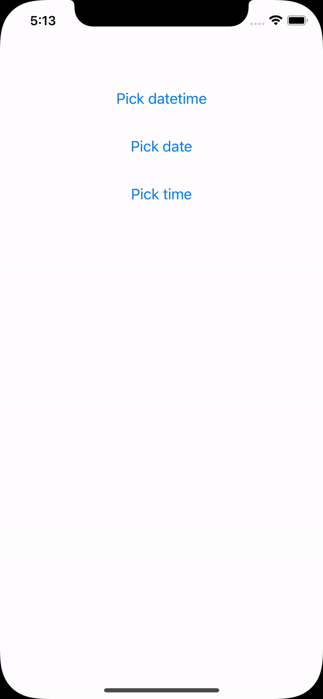
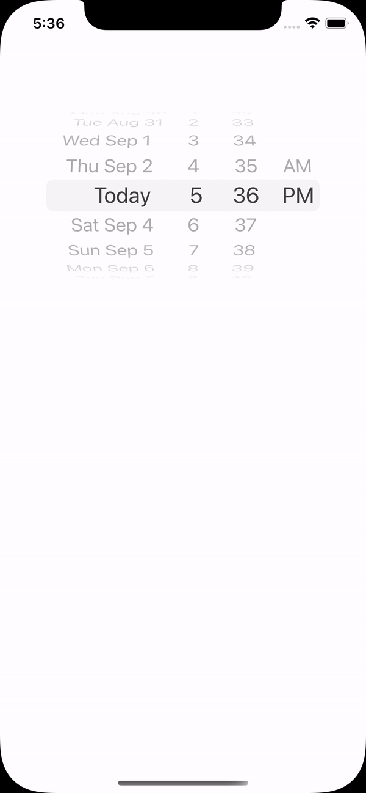
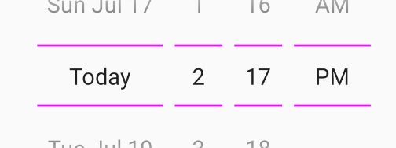
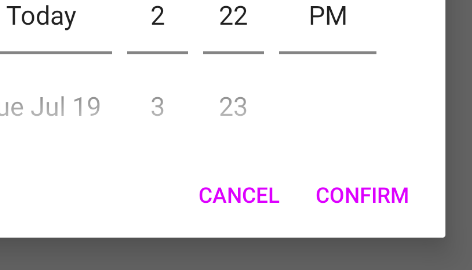

# React Native Date Picker [](https://www.npmjs.com/package/react-native-date-picker) [](https://github.com/henninghall/react-native-date-picker/actions) [](https://www.npmjs.com/package/react-native-date-picker)

This is a React Native Date Picker with following main features:

📱&nbsp; Supports iOS, Android and Expo<br>
🕑&nbsp; 3 different modes: Time, Date, DateTime <br>
🌍&nbsp; Various languages<br>
🎨&nbsp; Customizable<br>
🖼&nbsp; Modal or Inlined<br>

## Modal

The first option is to use the built-in modal. <a href="#example-1-modal">See code</a>.

<table>
   <tr>
  <td></td>
        <td>
    </td>
  </tr>
      <tr>
  <td align="center">iOS</td><td align="center">Android</td>
  </tr>
  </table>

## Inlined

The second option is to use the inlined picker. Place it in a View or a custom made modal. <a href="#example-2-inlined">See code</a>.

<table>
   <tr>
  <td></td>
        <td>
    </td>
  </tr>
      <tr>
  <td align="center">iOS</td><td align="center">Android</td>
  </tr>
  </table>

## Requirements

- Xcode >= 11.6
- React Native >= 0.57.
- If using React Native 0.64, 0.64.2 or later must be used.
- If using Expo, SDK 42 or later must be used. If using Expo SDK 44, 44.0.4 or later must be used.

## Expo

- ✅ You can use this library with [Development Builds](https://docs.expo.dev/development/introduction/). No config plugin is required.
- ❌ This library can't be used in the "Expo Go" app because it [requires custom native code](https://docs.expo.dev/workflow/customizing/).

## Installation

1. Download package with npm or yarn

```
npm install react-native-date-picker
```

```
yarn add react-native-date-picker
```

2. Install pods

```
cd ios && pod install
```

3. Rebuild the project

```
npx react-native run-android
npx react-native run-ios
```

If you're having troubles after following these steps, there might be a <a href="https://github.com/henninghall/react-native-date-picker/#user-content-linking">linking issue</a>.

## Example 1: Modal

```jsx
import React, { useState } from 'react'
import { Button } from 'react-native'
import DatePicker from 'react-native-date-picker'

export default () => {
  const [date, setDate] = useState(new Date())
  const [open, setOpen] = useState(false)

  return (
    <>
      <Button title="Open" onPress={() => setOpen(true)} />
      <DatePicker
        modal
        open={open}
        date={date}
        onConfirm={(date) => {
          setOpen(false)
          setDate(date)
        }}
        onCancel={() => {
          setOpen(false)
        }}
      />
    </>
  )
}
```

## Example 2: Inlined

```jsx
import React, { useState } from 'react'
import DatePicker from 'react-native-date-picker'

export default () => {
  const [date, setDate] = useState(new Date())

  return <DatePicker date={date} onDateChange={setDate} />
}
```

## Props

| Prop                      | Description                                                                                                                                                                                                                                                                                                           | Screenshots iOS                                                                                                                                                                                                                                                | Screenshot Android                                                                                                                                                                                                                                                                                 |
| ------------------------- | --------------------------------------------------------------------------------------------------------------------------------------------------------------------------------------------------------------------------------------------------------------------------------------------------------------------- | -------------------------------------------------------------------------------------------------------------------------------------------------------------------------------------------------------------------------------------------------------------- | -------------------------------------------------------------------------------------------------------------------------------------------------------------------------------------------------------------------------------------------------------------------------------------------------- |
| `date`                    | The currently selected date.                                                                                                                                                                                                                                                                                          |
| `onDateChange`            | Date change handler                                                                                                                                                                                                                                                                                                   |
| `fadeToColor`             | Android picker is fading towards this background color. {color, 'none'}                                                                                                                                                                                                                                               |
| `maximumDate`             | Maximum selectable date. <br/> Example: `new Date("2021-12-31")`                                                                                                                                                                                                                                                      |
| `minimumDate`             | Minimum selectable date. <br/> Example: `new Date("2021-01-01")`                                                                                                                                                                                                                                                      |
| `androidVariant`          | Choose from 2 android style variants. `"iosClone"`, `"nativeAndroid"`                                                                                                                                                                                                                                                 |                                                                                                                                                                                                                                                                |                                                                                                        |
| `minuteInterval`          | The interval at which minutes can be selected.                                                                                                                                                                                                                                                                        |                                                                                                                                                                 |                                                                                                                                                                                             |
| `mode`                    | The date picker mode. `"datetime"`, `"date"`, `"time"`                                                                                                                                                                                                                                                                |  |  |
| `locale`                  | The locale for the date picker. Changes language, date order and am/pm preferences. Value needs to be a <a title="react native datepicker locale id" href="https://developer.apple.com/library/content/documentation/MacOSX/Conceptual/BPInternational/LanguageandLocaleIDs/LanguageandLocaleIDs.html">Locale ID.</a> |                                                                                                                                                             |                                                                                                                                                                                         |
| `textColor`               | Changes the text color. ⚠ Colors other than black (#000000) or white (#ffffff) will replace the "Today" string with a date on iOS 13 or higher.                                                                                                                                                                       |                                                                                                                                                  |                                                                                                                                                                                                      |
| `timeZoneOffsetInMinutes` | Timezone offset in minutes (default: device's timezone)                                                                                                                                                                                                                                                               |
| `dividerHeight`           | Change the divider height (only supported for iosClone)                                                                                                                                                                                                                                                               |
| `is24hourSource`          | Change how the 24h mode (am/pm) should be determined, by device settings or by locale. {'locale', 'device'} (android only, default: 'device')                                                                                                                                                                         |
| `modal`                   | Boolean indicating if modal should be used. Default: `"false"`. When enabled, the other modal props needs to be used. <a href="#modal">See example</a>.                                                                                                                                                               |
| `open`                    | Modal only: Boolean indicating if modal should be open.                                                                                                                                                                                                                                                               |
| `onConfirm`               | Modal only: Date callback when user presses confirm button                                                                                                                                                                                                                                                            |
| `onCancel`                | Modal only: Callback for when user presses cancel button or closing the modal by pressing outside it.                                                                                                                                                                                                                 |
| `title`                   | Modal only: Title text. Can be set to null to remove text.                                                                                                                                                                                                                                                            |
| `confirmText`             | Modal only: Confirm button text.                                                                                                                                                                                                                                                                                      |
| `cancelText`              | Modal only: Cancel button text.                                                                                                                                                                                                                                                                                       |
| `theme`                   | Modal only, iOS 13+: The theme of the modal. `"light"`, `"dark"`, `"auto"`. Defaults to `"auto"`.                                                                                                                                                                                                                     |

## Additional android styling

There are som additional styling possibilities for the "androidNative" picker variant.

### Divider color



To change the divider color, open `styles.xml` and place this code right above the `</resources>`.

```xml
<style name="DatePickerTheme" parent="DatePickerBaseTheme">
    <item name="android:colorControlNormal">#dd00ff</item>
</style>
```

### Button colors



To change the confirm and cancel button colors. Open `styles.xml` and place this code within your theme.

```xml
  <item name="colorAccent">#dd00ff</item>
```

### Font size

To change the font size on Android `nativeAndroid` variant. Open `styles.xml` and place this code right above the `</resources>`. The font size is not possible to change in iOS out of the box, but there are some [iOS workarounds](https://github.com/henninghall/react-native-date-picker/discussions/171).

```xml
<style name="DatePickerTheme" parent="DatePickerBaseTheme">
    <item name="android:textSize">25sp</item>
</style>
```

## Linking

This package supports automatic linking. Usually, the only thing you need to do is to install the package, the cocoapods dependencies (as described above). Then rebuild the project by running `react-native run-ios`, `react-native run-android` or start the build from within Xcode/Android Studio. If you're running a React Native version below 0.60 or your setup is having issues with automatic linking, you can run `npx react-native link react-native-date-picker` and rebuild. In some occations you'll have to manually link the package. Instructions in <a href="https://github.com/henninghall/react-native-date-picker/issues/40">this issue</a>.

## FAQ

### How do i change the date order? (To YYYY-MM-DD etc)

The order is determined by the `locale` prop. Set for instance `locale='fr'`to get the french preference.

### How do i change the 12/24h or AM/PM format?

On iOS the 12/24h preference is determined by the `locale` prop. Set for instance `locale='fr'`to get the french preference. On Android the 12/24h format is determined by the device setting by default. Add `is24hourSource="locale"` to let the locale determine the device setting on android as well. When using 12h mode the AM/PM part of the picker will be displayed. It is NOT recommended to force any specific 12/24h format, but this can be achieved by, choosing a locale which has the desired 24h preference and add `is24hourSource="locale"`.

### Is it possible to show only month and year?

This is unfortunately not possible due to the limitation in DatePickerIOS. You should be able to create your own month-year picker with for instance https://github.com/TronNatthakorn/react-native-wheel-pick.

### Why does the Android app crash in production?

If you have enabled <a href="https://facebook.github.io/react-native/docs/signed-apk-android#enabling-proguard-to-reduce-the-size-of-the-apk-optional">Proguard</a> for Android you might need to ignore some classes to get the the picker to work properly in android production/release mode. Add these lines to you proguard file (often called `proguard-rules.pro`):

```
-keep public class net.time4j.android.ApplicationStarter
-keep public class net.time4j.PrettyTime
```

### What does it take to upgrade to v4 (4.0.0)?

There are no breaking changes in v4, so just bump the version number in your package json.

## Two different Android variants

On Android there are two design variants to choose from:

<table>
<tr><td align="center"><b>iOS clone</b></td><td align="center"><b>Native Android</b></td>  
  </tr><tr><td align="center">
 
</td><td align="center">
 
</td></tr>

<tr><td>The so called "iOS clone" looks and works similar to the ios version. It shows normally 5 lines of dates. It is enabled by default.</td><td>
The "Android Native" version looks more like a standard native implementation on Android.
</td></tr>
<tr><td>

```js
androidVariant = 'iosClone'
```

</td><td>

```js
androidVariant = 'nativeAndroid'
```

</td></tr>
</table>

## Three different modes

Here are some more info about the three different picker modes that are available.

### Date time picker

Using the datetime mode gives you a react native date time picker where both date and time can be selected at the same time. The todays date will be replays with the string "Today" translated to the desired language. This is the default mode and look like this.

<table><tr><td align="center"><b>iOS</b></td><td align="center"><b>Android</b></td>  
  </tr><tr><td>
    
</td><td>
    
</td></tr></table>

Add the optional `datetime` mode property to use this mode. Since datetime is default this could also be exclude.

```jsx
<DatePicker
  ...
  mode="datetime"
/>
```

### Datepicker

The date mode displays a react native datepicker with year month and date where the year-month-date order will be adjusted to the locale. If will look similar to this:

<table><tr><td align="center"><b>iOS</b></td><td align="center"><b>Android</b></td>  
  </tr><tr><td>
    
</td><td>
    
</td></tr></table>

Just add the value `date` to mode property:

```jsx
<DatePicker
  ...
  mode="date"
/>
```

### Time picker

The time mode can be used when only the time matters. AM/PM will be added depending on locale and user setting. It can be useful to add the `timeInterval` to only display the time with for instance 15min intervals. The react native time picker look like this:

<table><tr><td align="center"><b>iOS</b></td><td align="center"><b>Android</b></td>  
  </tr><tr><td>
    
</td><td>
    
</td></tr></table>

Set mode property to `time` to show the time picker:

```jsx
<DatePicker
  ...
  mode="time"
/>
```

## About

React Native Date Picker is a cross platform component for iOS and Android. It uses native code from respective platform to get the genuine look and feel the users expect. A strong motivation for creating this picker was the datetime mode on Android. It's quite unique for the platform and avoids two different picker popups, which normally is necessary. Instead, this datetime mode requires fewer user actions and enables a great user-experience.

## Support this package!

If you like this package, consider giving it a github star ⭐

Also, PR's are welcome!
