# React Native Date Picker [](https://www.npmjs.com/package/react-native-date-picker) [](https://app.bitrise.io/app/288d828c2f6731e6#/builds) [](https://www.npmjs.com/package/react-native-date-picker)

<!--
 [](https://app.bitrise.io/app/288d828c2f6731e6#/builds)

 [](https://app.bitrise.io/app/288d828c2f6731e6#/builds)
 -->

This is a React Native Date Picker with following main features:

📱 Supporting iOS and Android <br>
🕑 3 different modes: Time, Date, DateTime <br>
🌍 Multiple languages<br>
🎨 Customizable<br>

<!--
[](https://img.shields.io/npm/dm/react-native-date-picker.svg)
[](https://img.shields.io/npm/dt/react-native-date- picker.svg) -->

<table>
  <tr>
    <td align="center"><b>iOS</b></td>
    <td align="center"><b>Android</b></td>  
  </tr>
   <tr>
    <td>
    </td>
    <td>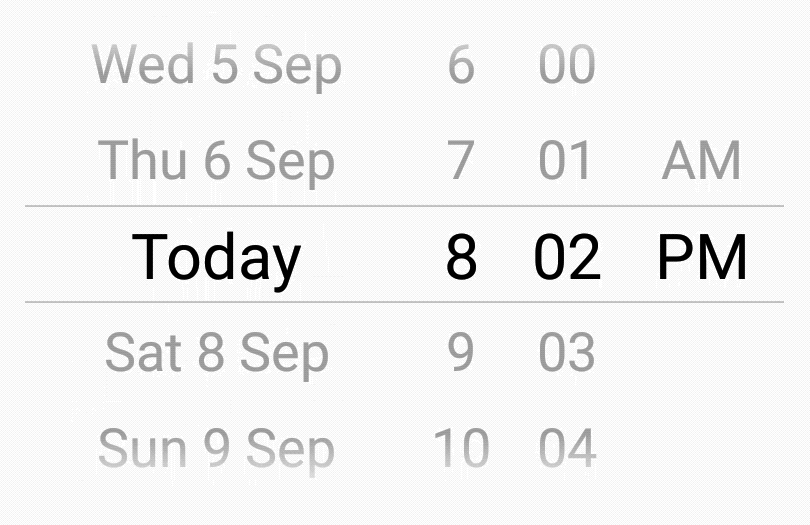
    </td>  
  </tr>
      <tr>
    <td align="center">A slightly improved DatePickerIOS.</td>
    <td align="center">A custom made native component.</td>  
  </tr>
  
  </table>
  
## Installation

1. `npm install react-native-date-picker --save`
2. `react-native link react-native-date-picker` (Only needed for React Native <= 0.59)

Xcode 11 is required to run the latest version of the date picker. Xcode 10 is supported up to version 2.7.2. 

## Minimal Example

```js
import React, { Component } from 'react'
import DatePicker from 'react-native-date-picker'

export default class App extends Component {
  state = { date: new Date() }

  render = () => (
    <DatePicker
      date={this.state.date}
      onDateChange={date => this.setState({ date })}
    />
  )
}
```

## Properties

| Prop                    | Description                                                                                                                                                                                                                                                                                                           | Screenshots iOS                                                                                                                                                                                                                          | Screenshot Android                                                                                                                                                                                                                                                 |
| ----------------------- | --------------------------------------------------------------------------------------------------------------------------------------------------------------------------------------------------------------------------------------------------------------------------------------------------------------------- | ---------------------------------------------------------------------------------------------------------------------------------------------------------------------------------------------------------------------------------------- | ------------------------------------------------------------------------------------------------------------------------------------------------------------------------------------------------------------------------------------------------------------------ |
| date                    | The currently selected date.                                                                                                                                                                                                                                                                                          |
| onDateChange            | Date change handler                                                                                                                                                                                                                                                                                                   |
| fadeToColor             | Android picker is fading towards this background color. {color, 'none'}                                                                                                                                                                                                                                               |
| maximumDate             | Maximum selectable date.                                                                                                                                                                                                                                                                                              |
| minimumDate             | Minimum selectable date                                                                                                                                                                                                                                                                                               |
| minuteInterval          | The interval at which minutes can be selected.                                                                                                                                                                                                                                                                        | 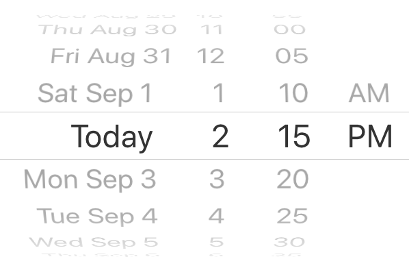                                                                                                                                          | 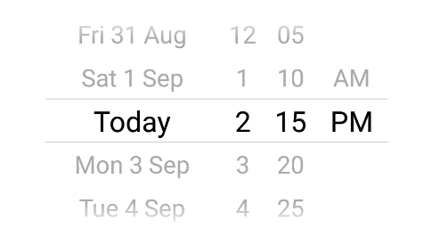                                                                                                                                                            |
| mode                    | The date picker mode. {'datetime', 'date', 'time'}                                                                                                                                                                                                                                                                    | 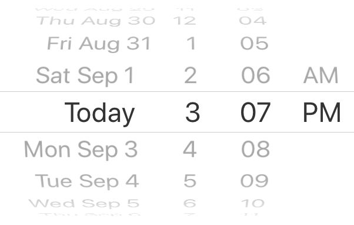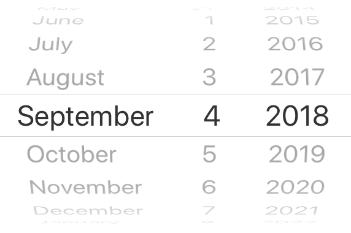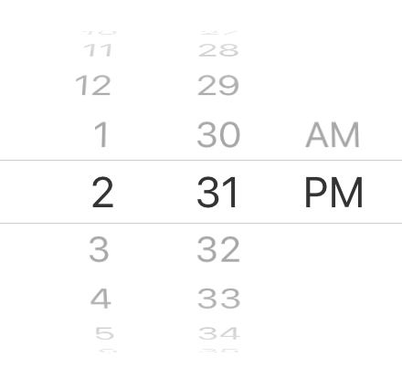 | 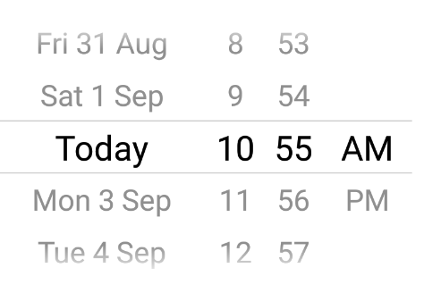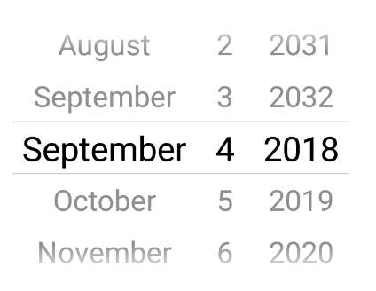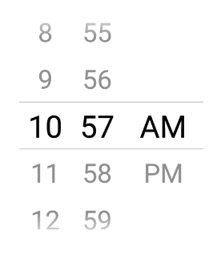 |
| locale                  | The locale for the date picker. Changes language, date order and am/pm preferences. Value needs to be a <a title="react native datepicker locale id" href="https://developer.apple.com/library/content/documentation/MacOSX/Conceptual/BPInternational/LanguageandLocaleIDs/LanguageandLocaleIDs.html">Locale ID.</a> | 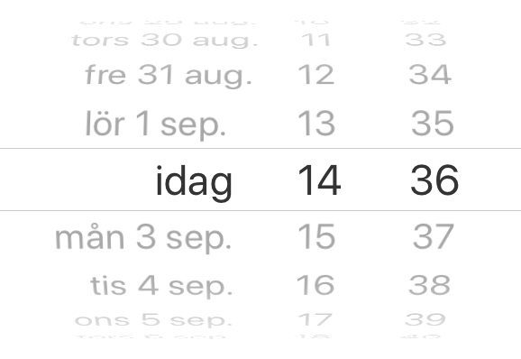                                                                                                                                      | 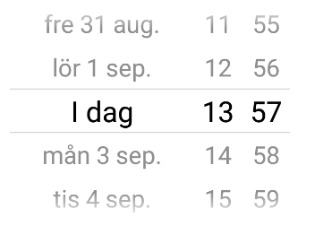                                                                                                                                                        |
| textColor               | Changes the text color. ⚠ Colors other than black (#000000) or white (#ffffff) will replace the "Today" string with a date on iOS 13.                                                                                                                                                                                 | 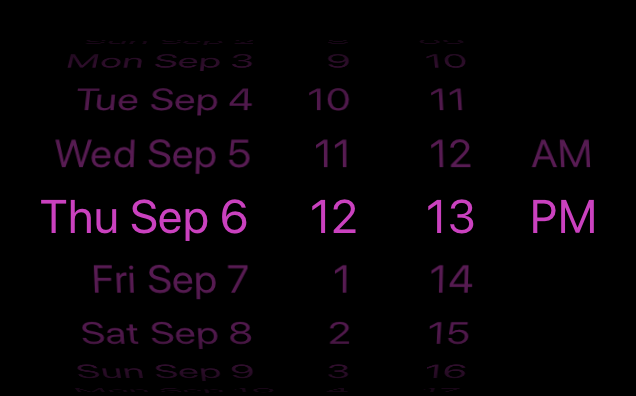                                                                                                                           | 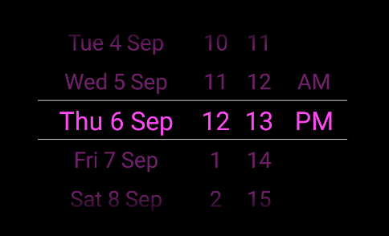                                                                                                                                                                     |
| timeZoneOffsetInMinutes | Timezone offset in minutes (default: device's timezone)                                                                                                                                                                                                                                                               |

## About

📅 &nbsp; React Native Date Picker is a cross platform component working on both iOS and Android. It uses the slightly improved DatePickerIOS on iOS and a custom picker on Android which has similar look and feel. The datetime mode might be particulary interesting if you looking for a way to avoid two different popup pickers on android.

## FAQ

### Can I use expo?

Unfortunately, expo does not support this date picker at the moment. Upvote <a href="https://expo.canny.io/feature-requests/p/support-react-native-date-picker">this feature request</a> if you would like to have it included.

### How do i change the date order? (To YYYY-MM-DD etc)

The order is determined by the `locale` prop. Set for instance `locale='fr'`to get the France preference.

### How do i change the 12/24h or AM/PM format?

On iOS the 12/24h preference is determined by the `locale` prop. Set for instance `locale='fr'`to get the France preference. On Android the 12/24h format is determined by the device setting. When using 12h mode the AM/PM part of the picker will be displayed.

### Is it possible to show only month and year?

This is unfortunately not possible due to the limitation in DatePickerIOS. You should be able to create your own month-year picker with for instance https://github.com/TronNatthakorn/react-native-wheel-pick.

### Why does the Android app crash in production?

If you have enabled <a href="https://facebook.github.io/react-native/docs/signed-apk-android#enabling-proguard-to-reduce-the-size-of-the-apk-optional">Proguard</a> for Android you might need to ignore some classes to get the the picker to work propery in android production/release mode. Add these lines to you proguard file (often called `proguard-rules.pro`):

```
-keep public class net.time4j.android.ApplicationStarter
-keep public class net.time4j.PrettyTime
```

## Roadmap

- [x] Mode: datetime
- [x] Mode: date
- [x] Mode: time
- [x] Locale support. (AM/PM, 12h/24h toggled and strings translated)
- [x] Replace todays date with the string "Today" (considering locale)
- [x] Animate to date when state change occur.
- [x] Switch between AM/PM when scrolling between forenoon and afternoon.
- [x] Support maximumDate/minimumDate.
- [x] Minute interval prop.
- [x] Colored background support.
- [x] Colored text support.

## Why another React Native date picker?

One of the strongest reason to use react native is its cross platform compatibility. Most of the official components are working seamlessly on both platforms but there are some with single platform support only. The react native datepicker is one example where both <a href="https://facebook.github.io/react-native/docs/datepickerios">DatePickerIOS</a> and <a href="https://facebook.github.io/react-native/docs/datepickerandroid">DatePickerAndroid</a> are present. The reason for this is that the default date picker is implemented in seperate ways, iOS normally have an integrated view picker wheel where android has different pickers in a dialog format.

If you want to use these pickers you can combile the official ones or a third party module that already done that for you. If you on the other hand want have a more unified design between your android and ios app, this module is for you. The datetime mode can be particularly helpful to avoid 2 separate picker dialogs on android.

<!--
## TODO EXTRA
- [ ] Transparent background support. (Probably need to include transparent gradient).
- [ ] Screen recordings
- [ ] Gray out max/min values.
- [ ] Align text to right.
-->
