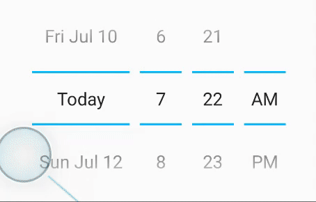
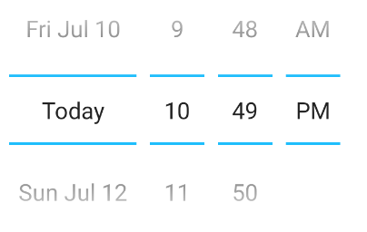

# React Native Date Picker [](https://www.npmjs.com/package/react-native-date-picker) [](https://github.com/henninghall/react-native-date-picker/actions) [](https://www.npmjs.com/package/react-native-date-picker)

This is a React Native Date Picker with following main features:

📱 Supporting iOS and Android <br>
🕑 3 different modes: Time, Date, DateTime <br>
🌍 Multiple languages<br>
🎨 Customizable<br>

<table>
  <tr>
    <td align="center"><b>iOS</b></td>
  </tr>
   <tr>
    <td>
    </td>
  </tr>

  <tr>
    <td align="center" colspan="2"><b>Android</b><br>Choose from 2 different variants</td>
  </tr>
   <tr>
    <td>
    </td>
        <td>
        </td>  
  </tr>
      <tr>
  <td align="center"><code>androidVariant="iosClone"</code></td><td align="center"><code>androidVariant="nativeAndroid"</code></td>
  </tr>
  </table>
  
## Installation

1. ```npm install react-native-date-picker``` or ```yarn add react-native-date-picker```
1. `(cd ios && pod install)` (If you're using CocoaPods)
1. Rebuild the project (e.g. `react-native run-android` or `react-native run-ios`)

If you're having troubles after following these steps, there might be a <a href="/#user-content-linking">linking issue</a>

## Requirements

- Xcode >= 11.6

## Minimal Example

```jsx
import React, { useState } from 'react'
import DatePicker from 'react-native-date-picker'

export default () => {

  const [date, setDate] = useState(new Date())

  return (
    <DatePicker
      date={date}
      onDateChange={setDate}
    />
  )
}

```

## Properties

| Prop                    | Description                                                                                                                                                                                                                                                                                                           | Screenshots iOS                                                                                                                                                                                                                          | Screenshot Android                                                                                                                                                                                                                                                 |
| ----------------------- | --------------------------------------------------------------------------------------------------------------------------------------------------------------------------------------------------------------------------------------------------------------------------------------------------------------------- | ---------------------------------------------------------------------------------------------------------------------------------------------------------------------------------------------------------------------------------------- | ------------------------------------------------------------------------------------------------------------------------------------------------------------------------------------------------------------------------------------------------------------------ |
| date                    | The currently selected date.                                                                                                                                                                                                                                                                                          |
| onDateChange            | Date change handler                                                                                                                                                                                                                                                                                                   |
| fadeToColor             | Android picker is fading towards this background color. {color, 'none'}                                                                                                                                                                                                                                               |
| maximumDate             | Maximum selectable date. <br/> Example: `new Date("2021-12-31")`                                                                                                                                                                                                                                                                                               |
| minimumDate             | Minimum selectable date. <br/> Example: `new Date("2021-01-01")`                                                                                                                                                                                                                                                                                              |
| androidVariant          | Choose from 2 android style variants. {'iosClone', 'nativeAndroid'} (default: 'iosClone')                                                                                                                                                                                                                                                                         |                                                                                                                                           |                                                                                                                                                             |
| minuteInterval          | The interval at which minutes can be selected.                                                                                                                                                                                                                                                                        |                                                                                                                                           |                                                                                                                                                             |
| mode                    | The date picker mode. {'datetime', 'date', 'time'}                                                                                                                                                                                                                                                                    |  |  |
| locale                  | The locale for the date picker. Changes language, date order and am/pm preferences. Value needs to be a <a title="react native datepicker locale id" href="https://developer.apple.com/library/content/documentation/MacOSX/Conceptual/BPInternational/LanguageandLocaleIDs/LanguageandLocaleIDs.html">Locale ID.</a> |                                                                                                                                       |                                                                                                                                                         |
| textColor               | Changes the text color. ⚠ Colors other than black (#000000) or white (#ffffff) will replace the "Today" string with a date on iOS 13 or higher.                                                                                                                                                                                 |                                                                                                                            |                                                                                                                                                                      |
| timeZoneOffsetInMinutes | Timezone offset in minutes (default: device's timezone)                                                                                                                                                                                                                                                               |
| dividerHeight | Change the divider height (only supported for iosClone)                                                                                                                                                                                                                                                               |
| is24hourSource | Change how the 24h mode (am/pm) should be determined, by device settings or by locale. {'locale', 'device'} (android only, default: 'device')                                                                                                                                                                                                                                       |
## Linking
This package supports automatic linking. Usually, the only thing you need to do is to install cocoapods dependencies as descripted above and rebuild the project by running `react-native run-ios`, `react-native run-android` or start the build from within Xcode/Android Studio. If you'running a React Native version below 0.60 or your settup are having issues with automatic linking, you can run `npx react-native link react-native-date-picker` and rebuild. In some occations you even have to manually link the package. Instructions in <a href="https://github.com/henninghall/react-native-date-picker/issues/40">this issue</a>.           

## About

📅 &nbsp; React Native Date Picker is a cross platform component working on both iOS and Android. It uses the slightly improved DatePickerIOS on iOS and a custom picker on Android which has similar look and feel. The datetime mode might be particulary interesting if you looking for a way to avoid two different popup pickers on android.

## FAQ

### How do I change the divider color?
The color of the divider, separator (or whatever you choose to call it) can only be changed on android for the androidNative variant. To change it, add the following to your android AppTheme. The theme is often found in styles.xml. 
```xml
<item name="colorControlNormal">#ff0000</item>
```

### Can I use expo?

Unfortunately, expo does not support this date picker at the moment. Upvote <a href="https://expo.canny.io/feature-requests/p/support-react-native-date-picker">this feature request</a> if you would like to have it included.

### How do i change the date order? (To YYYY-MM-DD etc)

The order is determined by the `locale` prop. Set for instance `locale='fr'`to get the french preference.

### How do i change the 12/24h or AM/PM format?

On iOS the 12/24h preference is determined by the `locale` prop. Set for instance `locale='fr'`to get the french preference. On Android the 12/24h format is determined by the device setting by default. Add `is24hourSource="locale"` to let the locale determine the device setting on android as well. When using 12h mode the AM/PM part of the picker will be displayed. It is NOT recommended to force any specific 12/24h format, but this can be achieved by, choosing a locale which has the desired 24h preference and add `is24hourSource="locale"`.

### Is it possible to show only month and year?

This is unfortunately not possible due to the limitation in DatePickerIOS. You should be able to create your own month-year picker with for instance https://github.com/TronNatthakorn/react-native-wheel-pick.

### Why does the Android app crash in production?

If you have enabled <a href="https://facebook.github.io/react-native/docs/signed-apk-android#enabling-proguard-to-reduce-the-size-of-the-apk-optional">Proguard</a> for Android you might need to ignore some classes to get the the picker to work propery in android production/release mode. Add these lines to you proguard file (often called `proguard-rules.pro`):

```
-keep public class net.time4j.android.ApplicationStarter
-keep public class net.time4j.PrettyTime
```

## Two different Android variants
On Android there are two design variants to choose from:

<table>
<tr><td align="center"><b>iOS clone</b></td><td align="center"><b>Native Android</b></td>  
  </tr><tr><td align="center">
 
</td><td align="center">
 
</td></tr>

<tr><td>The so called "iOS clone" looks and works similar to the ios version. It shows normaly 5 lines of dates. It is enabled by default.</td><td>
The "Android Native" version looks more like a standard native implementation on Android. The divider color can be changed by adding the following to you Android theme:
<br><code>&lt;item name=&quot;colorControlNormal&quot;&gt;#03b6fc&lt;/item&gt;</code>
</td></tr>
<tr><td>

```js
androidVariant="iosClone"
```
</td><td>

```js
androidVariant="nativeAndroid"
```
</td></tr>
</table>


## Three different modes
Here are some more info about the three different picker modes that are available.

### Date time picker
Using the datetime mode gives you a react native date time picker where both date and time can be selected at the same time. The todays date will be replays with the string "Today" translated to the desired language. This is the default mode and look like this.

<table><tr><td align="center"><b>iOS</b></td><td align="center"><b>Android</b></td>  
  </tr><tr><td>
    
</td><td>
    
</td></tr></table>

Add the optional `datetime` mode property to use this mode. Since datetime is default this could also be exclude. 

```jsx
<DatePicker
  ...
  mode="datetime"
/>
```

### Datepicker
The date mode displays a react native datepicker with year month and date where the year-month-date order will be adjusted to the locale. If will look similar to this: 
<table><tr><td align="center"><b>iOS</b></td><td align="center"><b>Android</b></td>  
  </tr><tr><td>
    
</td><td>
    
</td></tr></table>

Just add the value `date` to mode property: 

```jsx
<DatePicker
  ...
  mode="date"
/>
```

### Time picker
The time  mode can be used when only the time matters. AM/PM will be added depending on locale and user setting. It can be useful to add the `timeInterval` to only display the time with for instance 15min intervals. The react native time picker look like this:
<table><tr><td align="center"><b>iOS</b></td><td align="center"><b>Android</b></td>  
  </tr><tr><td>
    
</td><td>
    
</td></tr></table>

Set mode property to `time` to show the time picker: 

```jsx
<DatePicker
  ...
  mode="time"
/>
```


## Why another React Native datepicker?

One of the strongest reason to use react native is its cross platform compatibility. Most of the official components are working seamlessly on both platforms but there are some with single platform support only. The react native datepicker is one example where both <a href="https://facebook.github.io/react-native/docs/datepickerios">DatePickerIOS</a> and <a href="https://facebook.github.io/react-native/docs/datepickerandroid">DatePickerAndroid</a> are present. The reason for this is that the default date picker is implemented in seperate ways, iOS normally have an integrated view picker wheel where android has different pickers in a dialog format.

If you want to use these pickers you can combile the official ones or a third party module that already done that for you. If you on the other hand want have a more unified design between your android and ios app, this module is for you. The datetime mode can be particularly helpful to avoid 2 separate picker dialogs on android.

